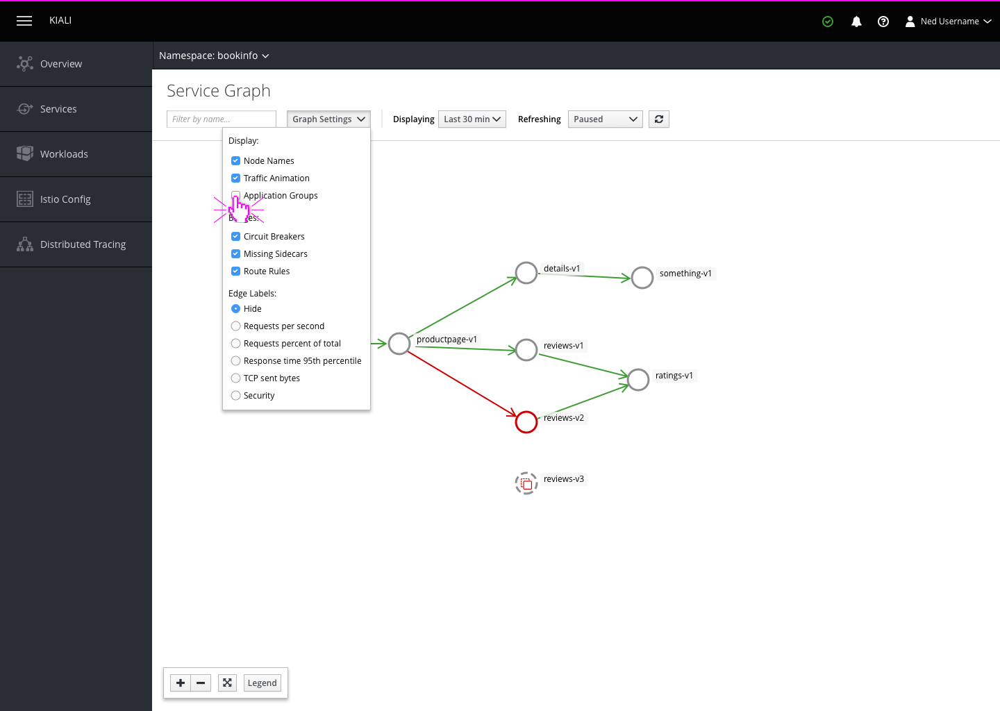

# Condensed Nodes

## Workload view
Workloads are shown as small circles on the graph with their names printed externally on semi-transparent backgrounds.

## Application view
Application groups could be toggled with a control in the graph settings, or could be active all the time.

When Application groups are shown, app versions are displayed as circles within rectangular application groups and applications without multiple versions are displayed as squares. Any workloads without an app label are still displayed as circles.

## Application view (condensed)
Application groups can be collapsed and expanded individually by clicking on the icon that appears when hovering over application groups. Alternatively all groups on the page could be toggled at once by clicking on the buttons in the zoom tool area.

